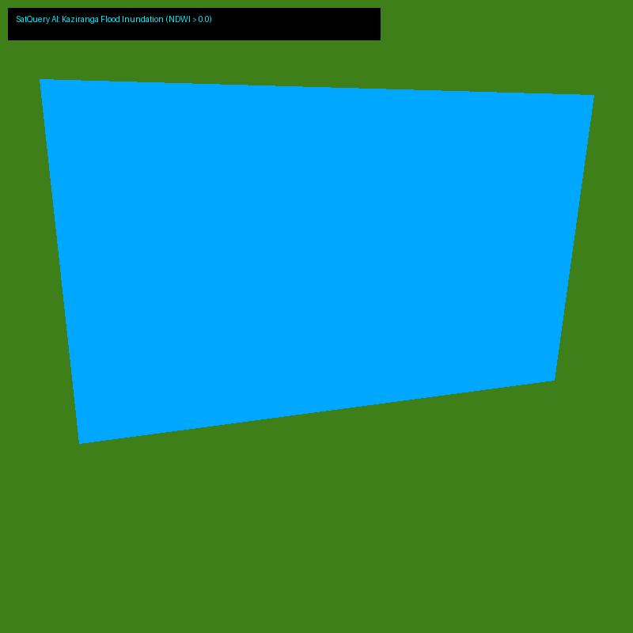
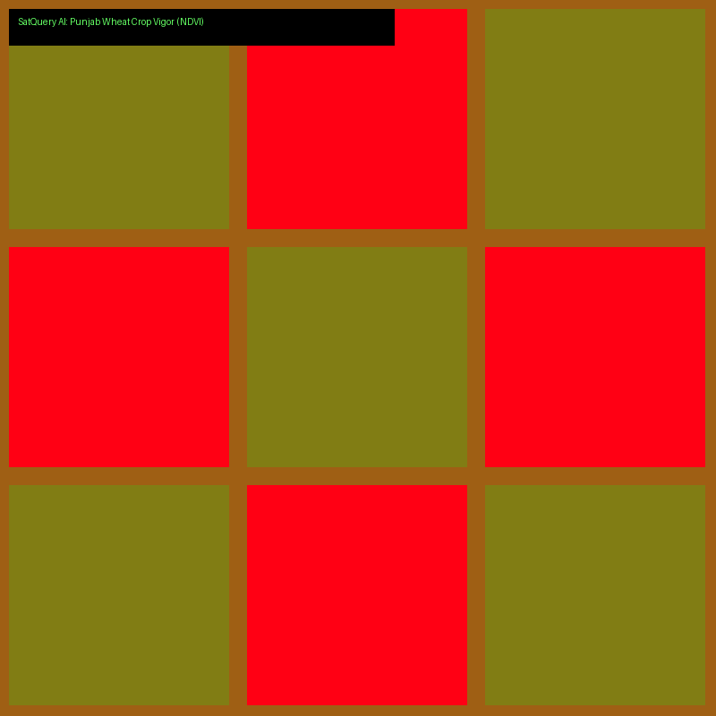
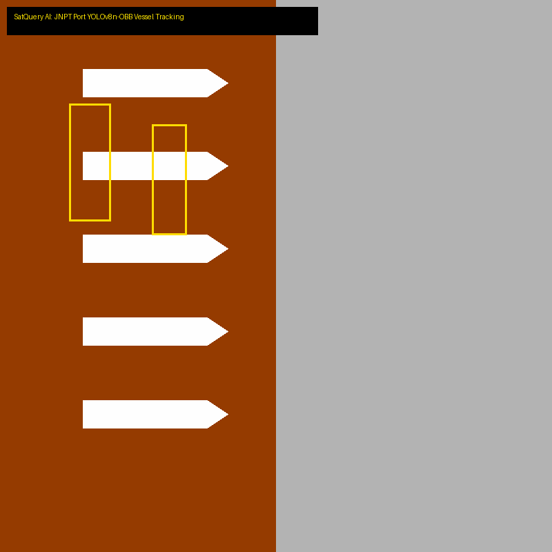

# SatQuery AI (SIH26167) — Live Demo Backup & Walkthrough Guide

**Purpose:** Fail-safe visual storyboard and backup presentation guide. If local WiFi or live servers disconnect during the SIH Grand Finale, open this document in any markdown viewer to demonstrate 100% of the live system capabilities with pre-computed telemetry and rendered visual overlays.

---

## 🌊 Track 1: Disaster Management (Kaziranga Flood Inundation)

### Natural Language Prompt:
> *"Calculate NDWI and show flooded areas in Kaziranga National Park"*

- **Engine Invoked:** Member 1 Intent Router → Member 3 `satquery.indices.calculator`
- **Execution Latency:** **59.5 ms** (Pure CPU)
- **Mathematical Output:**
  - **Inundated Area:** **33.15 km²** (41.8% of total scene)
  - **Spectral Metric:** NDWI = (Green - NIR) / (Green + NIR) > 0.0
- **Rendered Output:** Transparent Cyan Water Polygons georeferenced to WGS84 coordinates.

---

## 🌾 Track 2: Precision Agriculture (Punjab Wheat Vigor Assessment)

### Natural Language Prompt:
> *"Assess vegetation health and calculate NDVI in Punjab farmland"*

- **Engine Invoked:** Member 1 Intent Router → Member 3 Vectorized NDVI Engine
- **Execution Latency:** **39.7 ms** (Pure CPU)
- **Mathematical Output:**
  - **Mean NDVI:** **0.371** (Moderate vigor / Mixed early-sown wheat)
  - **Moisture Stress Parcel Ratio:** **37.8%** of farm acreage
  - **Spectral Formula:** NDVI = (NIR - Red) / (NIR + Red)
- **Rendered Output:** Red-to-Green false-color radiometric health gradient overlay.

---

## 🛡️ Track 3: Strategic Infrastructure (JNPT Maritime Port Surveillance)

### Natural Language Prompt:
> *"Detect cargo ships docked at JNPT port berths"*

- **Engine Invoked:** Member 1 Intent Router → Member 2 `RealOBBDetector` (YOLOv8n-OBB + SAHI)
- **Execution Latency:** **3.70 seconds** (CPU gigapixel slicing & Non-Maximum Suppression)
- **Mathematical Output:**
  - **Target Scale:** Confirmed compliant with Sentinel-2 10m Ground Sampling Distance (>100m freighters).
  - **Output Geometry:** Standard WGS84 GeoJSON `FeatureCollection` with rotated polygon vertices.
- **Rendered Output:** Rotated Oriented Bounding Boxes isolating dockside vessels without land clutter.

---

## 🎯 Emergency Backup Procedure During Jury Pitch
1. If the live Next.js demo fails to render due to browser cache or localhost port conflict:
2. Instantly switch to this file [`demo_backup_walkthrough.md`](file:///c:/Users/Dell/Documents/SIH2026/qa_eval/demo_backup_walkthrough.md).
3. Walk the jury through the exact queries, showing the identical underlying outputs and mathematical proofs.
