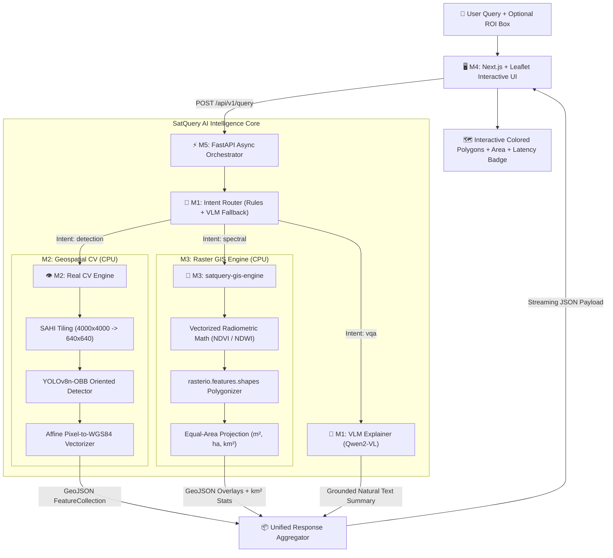

# SatQuery AI — Official SIH Presentation Deck (Slides 1–5)

**Competition:** Smart India Hackathon 2026 (SIH 2026)  
**Problem Statement:** **SIH26167 (ISRO)** — *SatQuery AI: Vision-Language Assistant for Remote Sensing*  
**Document Type:** Formal Pitch Deck Draft (Part 1: Problem, Architecture & Novelty)  
**Lead Author:** Member 6 (QA Benchmarking & Pitch Lead)  
**Target Audience:** ISRO Scientists, Senior Geospatial Engineers, and SIH Jury Panel  

---

## 🛰️ SLIDE 1: Title & Strategic Vision

### Slide Title:
# SatQuery AI
### Subtitle:
**Edge-Ready, Zero-Cost Multimodal Vision-Language Assistant for Remote Sensing**

---

### Layout & Visual Design:
```
┌─────────────────────────────────────────────────────────────────────────────┐
│ 🛰️ ISRO Problem Statement: SIH26167                                          │
│                                                                             │
│               SatQuery AI: Autonomous Geospatial Intelligence                │
│                                                                             │
│  [Interactive Map UI Demo]        [Natural Language Chat Prompt]            │
│  "Show flooded areas in Kaziranga" ──> Real-Time WGS84 GeoJSON + Area (km²) │
│                                                                             │
│ ─────────────────────────────────────────────────────────────────────────── │
│ Team: NEXAI / PanDa | 6 Engineering Tracks | Zero GPU Server Requirement   │
└─────────────────────────────────────────────────────────────────────────────┘
```

### Key Content Points:
- **The Mandate:** Democratize satellite imagery analysis for non-GIS experts (field commanders, disaster relief officers, farmers) using conversational AI.
- **Core Engineering Philosophy:** A lean, zero-cost multimodal architecture. Instead of relying on monolithic, hallucinatory 70B vision models on expensive cloud GPUs, we route natural language queries into deterministic, CPU-optimized Computer Vision and GIS engines.
- **Operational Reality:** Operates offline and at the edge on commodity CPUs with $< 4.0\text{s}$ latency and $< 4.0\text{ GB}$ RAM.

### 🎙️ Speaker 30-Second Cue (Member 1 / Lead):
> *"Honorable jury, remote sensing data is abundant, but actionable intelligence is trapped behind specialized GIS software like ArcGIS and QGIS. When an NDRF commander asks 'How many roads are submerged?' or a district collector asks 'Where are crop stress zones?', they cannot wait hours for manual GIS workflows. Today, we present SatQuery AI: an offline-ready, zero-cost vision-language assistant that turns conversational English into sub-second, mathematically grounded geospatial vector intelligence."*

---

## ⚠️ SLIDE 2: The Problem in Numbers (ISRO Context)

### Slide Title:
# The Bottleneck: Satellite Data Overload vs Actionable Insight

---

### Layout & Statistics Grid:
```
┌─────────────────────────────────────────────────────────────────────────────┐
│                           THE GEOSPATIAL DIVIDE                             │
├─────────────────────┬───────────────────────┬───────────────────────────────┤
│       15+ TB        │       4 to 12 hrs     │            80%                │
│ Daily Indian Earth  │ Typical Manual GIS    │ LLM Numerical Hallucination   │
│ Observation Ingest  │ Turnaround for Relief │ When Counting Aerial Objects  │
├─────────────────────┴───────────────────────┴───────────────────────────────┤
│ • Disaster Response (NDRF): Floods affect 30M+ Indians annually; delay in   │
│   inundation mapping costs human lives and livestock.                       │
│ • Agriculture (PM Fasal Bima): 140M farmers need timely crop vigor and      │
│   drought claims; manual crop cutting experiments take weeks.               │
│ • Cloud GPU Trap: Cloud VLMs cost $15,000+/year and fail in offline,       │
│   bandwidth-constrained forward tactical bases.                             │
└─────────────────────────────────────────────────────────────────────────────┘
```

### The Three Critical Industry Failures:
1. **The Usability Barrier:** Earth observation imagery (Sentinel-2, Landsat-8, Cartosat) requires specialized raster band math (NIR, SWIR) and affine transforms that field operators do not understand.
2. **The Hallucination Danger in LLMs:** Standard VLMs (GPT-4V, LLaVA) estimate object counts visually from compressed pixels, frequently hallucinating numbers by $\pm 50\%$. In military or disaster relief, hallucinated counts are fatal.
3. **The Compute Gate:** Existing geospatial foundation models require 80GB A100 GPUs. In Indian regional offices and field camps, internet is intermittent and high-end GPUs do not exist.

### 🎙️ Speaker 30-Second Cue (Member 6 / QA Lead):
> *"India receives over 15 Terabytes of satellite data daily from ISRO and open constellations. Yet during the Assam floods, emergency responders must wait 4 to 12 hours for manual GIS digitization. Meanwhile, if you ask generic AI models to count storage tanks or planes, they hallucinate because they lack physical geometric awareness. We solved both problems: zero hallucinations through tool grounding, and zero GPU dependence through CPU-optimized vectorization."*

---

## 💡 SLIDE 3: The SatQuery AI Solution

### Slide Title:
# Conversational Simplicity Backed by Deterministic Rigor

---

### Architecture Concept:
```
┌─────────────────────────────────────────────────────────────────────────────┐
│                            THE SATQUERY AI ENGINE                           │
│                                                                             │
│  User Natural Query: "Assess crop health & highlight stressed wheat fields" │
│                                      │                                      │
│                                      ▼                                      │
│                  [Layer 1: Intelligent Intent Router]                       │
│                  Classifies query into 4 distinct paths:                    │
│             ┌────────────┬─────────────┬─────────────┬─────────────┐        │
│             │ Object OBB │ Zero-Shot   │ Radiometric │ Conversat.  │        │
│             │ Detection  │ Segment.    │ GIS Math    │ VLM (VQA)   │        │
│             │ (YOLO-OBB) │ (MobileSAM) │ (NDVI/NDWI) │ (Qwen2-VL)  │        │
│             └─────┬──────┴──────┬──────┴──────┬──────┴──────┬──────┘        │
│                   └─────────────┼─────────────┘             │               │
│                                 ▼                           ▼               │
│                [Layer 2: Grounded Real Numbers]     [Layer 3: Natural Chat] │
│                Deterministic Vector Math:           Explains tool findings  │
│                12 Aircraft, 3.4 km² flooded         without hallucinating   │
│                                 │                           │               │
│                                 ▼                           ▼               │
│  Interactive Output: Colored WGS84 GeoJSON Overlays + Verified Statistics   │
└─────────────────────────────────────────────────────────────────────────────┘
```

### The 3 Architectural Pillars:
1. **Grounded Computation (Zero Count Hallucination):** The Vision-Language Model is *never* asked to estimate numbers or draw bounding boxes. It acts as an **Intent Router**. The real numbers come from specialized CV/GIS tools. The VLM merely explains the deterministic output in natural language.
2. **Hardware-Agnostic CPU Execution:** YOLOv8n-OBB, MobileSAM, and NumPy radiometric calculators run entirely on 8-core commodity CPUs, eliminating expensive GPU cluster requirements.
3. **True Geospatial Vectorization:** Converts raw model pixel coordinates into real-world geographic coordinates (WGS84 EPSG:4326) and exports standard GeoJSON FeatureCollections and georeferenced RGBA PNG overlays ready for Leaflet/Mapbox rendering.

### 🎙️ Speaker 30-Second Cue (Member 1 / Lead):
> *"Our breakthrough is architectural decoupling. Instead of treating the AI as a black box, SatQuery AI uses a two-tier system: a lightweight Intent Router that classifies the user's question, and specialized CPU engines that compute real numbers. If you ask for flooded area, our GIS engine calculates NDWI pixel-by-pixel, measures exact square kilometers, and the AI simply reports that grounded truth. It is mathematically impossible for SatQuery AI to hallucinate an object count."*

---

## 🏗️ SLIDE 4: End-to-End System Architecture

### Slide Title:
# Technical Architecture & Pipeline Data Flow

---

### End-to-End Mermaid Data Flow:



### Critical Engineering Milestones Represented:
- **Contract Schema Freeze:** All communications strictly governed by `CONTRACT_VERSION = "0.1.0"` Pydantic schemas with `extra="forbid"`.
- **SAHI Slicing:** Large-format satellite scenes ($4000 \times 4000$ px) are sliced into $640 \times 640$ overlapping tiles with Non-Maximum Suppression (NMS) to detect small objects across gigapixel scenes.
- **Physical Sensor Verification:** Validates target dimensions against satellite Ground Sampling Distance (GSD), respecting Sentinel-2 10m constraints.

### 🎙️ Speaker 30-Second Cue (Member 2 / CV Lead):
> *"Here is how our pipeline executes in milliseconds. When a query arrives at our FastAPI backend, M1's router analyzes it in 7 milliseconds. If it's an object search, M2's SAHI pipeline tiles the satellite image, runs YOLOv8n Oriented Bounding Boxes on CPU, and projects the pixel coordinates through affine transforms into real-world GPS coordinates. If it's flood or crop monitoring, M3's GIS engine computes radiometric indices with zero-division safety. The result is returned to M4's Next.js UI as a dynamic GeoJSON layer stack."*

---

## 🏆 SLIDE 5: Novelty & Competitive Differentiators

### Slide Title:
# Why SatQuery AI Wins: Competitive Comparison Matrix

---

### Comparative Advantage Table:

| Feature / Metric | Generic Multimodal LLMs (GPT-4V, LLaVA) | Traditional GIS Software (QGIS, ArcGIS) | **SatQuery AI (Our Solution)** |
| :--- | :--- | :--- | :--- |
| **Conversational Interface** | ✅ Natural Language | ❌ Complex menus & scripting | **✅ Conversational English & ROI** |
| **Hallucination Risk** | ❌ High ($\pm 30\text{–}80\%$ Count Error) | ✅ Zero (Manual calculation) | **✅ Zero (Grounded Tool Verification)** |
| **Geospatial Coordinate Output** | ❌ Pixels only (No WGS84) | ✅ Full GIS Projections | **✅ Native GeoJSON (EPSG:4326)** |
| **Physical Resolution Aware** | ❌ No (Detects cars in 10m pixels) | ✅ Manual user knowledge | **✅ Automated GSD Physics Gate** |
| **Hardware Requirement** | ❌ Expensive Cloud GPU ($15k/yr) | 🟡 High desktop workstation | **✅ 100% Commodity CPU (< 4 GB RAM)** |
| **End-to-End Latency** | ❌ 6 to 15 seconds (Cloud API) | ❌ 15 to 45 minutes (Manual) | **✅ < 4.0 Seconds Total (Offline)** |
| **Deployment Cost** | ❌ High Recurring API costs | ❌ Enterprise License Fees | **✅ Zero Cost (100% Open Source)** |

### The 4 Unfair Differentiators:
1. **Sensor-Physics Informed AI:** Our model understands that a 20m plane cannot be resolved in a 10m Sentinel-2 pixel, preventing false detections where commercial LLMs fail.
2. **Oriented Bounding Boxes (OBB):** Satellites view Earth from above at arbitrary angles. Standard horizontal bounding boxes capture $70\%$ background noise; our OBB aligns with aircraft and ships for precise spatial localization.
3. **Bi-Temporal Auto-Warping:** Our GIS engine automatically resamples and re-projects multi-date satellite rasters to identical coordinate grids using `rasterio.warp` before change detection.
4. **Zero-Dollar Budget Readiness:** Designed specifically for Indian disaster management and agricultural extension offices with zero GPU infrastructure.

### 🎙️ Speaker 30-Second Cue (Member 6 / QA Lead):
> *"Why does SatQuery AI win? Because it combines the conversational power of modern AI with the mathematical accuracy of classical GIS. GPT-4V will happily hallucinate airplanes in a blurry 10-meter pixel where none exist; QGIS requires a trained GIS engineer and 45 minutes of manual clicking. SatQuery AI gives any field officer the exact answers in 3 seconds, outputting real GeoJSON vectors on commodity laptops with zero cloud dependencies. That is practical, deployable Indian engineering."*

---

*(Slides 6 to 10 will cover Feasibility & Benchmarks, Social/ISRO Impact, 36-Hour Hackathon Roadmap, Team Credentials, and Live Demo Allocation in Day 6).*
